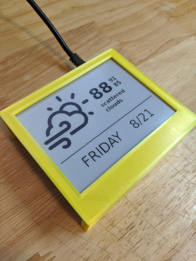

Node.js library for easily creating an ePaper display on a Raspberry Pi using HTML and Javascript.

-   Render HTML DOM onto ePaper display
-   Simple and extensible Javascript and WebSocket API
-   [Supports multiple Waveshare ePaper Displays](#supported-hardware)
-   High performance, native c++ hardware access




## Working with the API

###

Create `static/index.html`. The contents of this webpage will be rendered onto the ePaper display.

```html
<!DOCTYPE html>
<html lang="en">
    ...
    <body>
        <h1>Hello from ePaper.js</h1>
        <script>
            // connect to the WebSocket API
            const ws = new WebSocket('ws://localhost:8080');
            ws.addEventListener('open', () => {
                // draw contents of DOM onto ePaper display
                ws.send('render');
            });
        </script>
    </body>
</html>
```

From Node.js initialize ePaper.js. This does the following:

-   Creates a webserver that serves `index.html` from the `static` directory
-   Loads index.html in a headless instance of Chromium, using [Puppeteer](https://github.com/puppeteer/puppeteer)
-   Creates a WebSocket API that the frontend can use to trigger a display refresh, or perform custom actions
-   Renders the contents of the browser DOM onto the ePaper display

```js
const { init } = require('epaperjs');

init();
```

### Additional Configuration

**Additional Configuration Options**

```js
const { devices, init } = require('epaperjs');
init(devices.waveshare4in2, {
    webPort: 3000, // WebServer Port
    websocketPort: 8080, // WebSocket API Port
    staticDirectory: 'static', // Directory to serve frontend from
    url: `http://localhost:3000/index.html`, // Initial URL to load
});
```

**Extend the server side WebSocket API**

```js
const { devices, init } = require('epaperjs');

const render = (page, ws) => {
    // Forward frontend console output to Node.js console
    page.onConsoleLog(console.log);

    // When recieving 'render' from frontend, update display
    ws.on('message', async (message) => {
        if (message === 'render') {
            await page.display();
        }
    });

    // forward keypresses to the frontend over WebSocket
    process.stdin.addListener('keypress', (key, data) => {
        if (data.name === 'left') {
            ws.send('left');
        }
        if (data.name === 'right') {
            ws.send('right');
        }
    });
};

init(devices.waveshare4in2, {}, render);
```

**Examples**\
See the examples directory

-   weather-station: This creates and example weather station display
-   ereader: An ereader that reads epub files and uses the left and right keypresses to change pages

## Installation

**Raspberry PI**\
Enable SPI

```bash
sudo raspi-config
# Choose Interfacing Options -> SPI -> Yes  to enable SPI interface
sudo reboot
```

Install Dependencies

```bash
# Install latest Node.js LTS
curl -sL install-node.now.sh/lts | sudo bash

sudo apt-get update

# Install wiringpi
sudo apt-get install -y wiringpi

# For Pi 4, you need to update wiringpi (skip otherwise)：
cd /tmp
wget https://project-downloads.drogon.net/wiringpi-latest.deb
sudo dpkg -i wiringpi-latest.deb
#You will get 2.52 information if you've installed it correctly
gpio -v

# Remaining dependencies
sudo apt-get install -y build-essential chromium-browser
```

**Node.js**\
Install ePaper.js

```bash
npm install -S epaperjs
```

## Supported Hardware

| Device                                                                        | Supprted Display Modes |
| ----------------------------------------------------------------------------- | ---------------------- |
| [Waveshare 4.2"](https://www.waveshare.com/4.2inch-e-Paper.htm)               | Black / White, 4 Gray  |
| [Waveshare 7.5" v2](https://www.waveshare.com/7.5inch-e-Paper.htm)            | Black / White          |
| [Waveshare 3.7" hat](https://www.waveshare.com/3.7inch-e-paper-hat.htm)       | Black / White, 4 Gray  |
| [Waveshare 2.13" hat v2](https://www.waveshare.com/wiki/2.13inch_e-Paper_HAT) | Black / White          |

### Adding Support For Additional Displays

It's easy to extend ePaper.js to support additional Waveshare devices. Displays from other manufacturers should be possible to support as well, as long as there is a C / C++ driver available.

If you would like to request support for another display, please open an issue with the title 'Add support for <Device Make \ Model>'. If you're a developer and have extended support yourself, put up a pull request!

## Feature Backlog

-   [x] Add support for portrait or landscape display (rotate 90 deg)
-   [ ] Add support for remaining Waveshare SPI ePaper displays
-   [x] Implement 4 Color Grayscale
-   [ ] Implement Red / White / Black Color Mode
-   [ ] Implement Yellow / White / Black Color Mode
-   [ ] Implement Partial Refresh
